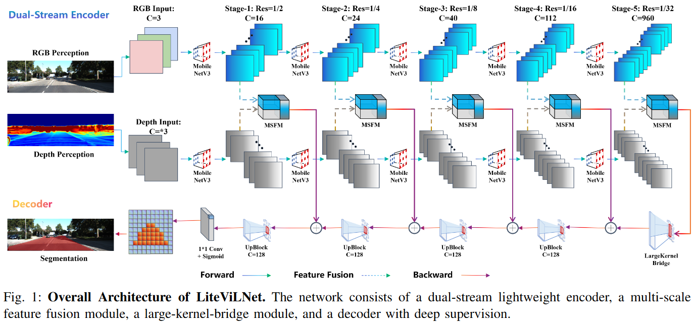
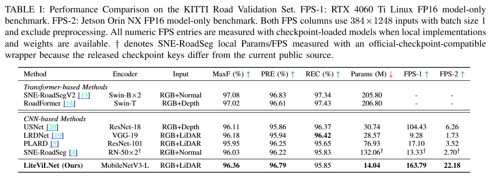

# LiteViLNet: Lightweight Vision-LiDAR Fusion Network for Efficient Road Segmentation

[](https://arxiv.org/abs/2605.21007)
[](https://www.python.org/)

LiteViLNet is a clean research workspace derived from VLLiNet for efficient RGB-LiDAR road segmentation on KITTI Road and embedded platforms.



This repository implements the model from the paper "LiteViLNet: Lightweight Vision-LiDAR Fusion Network for Efficient Road Segmentation".

LiteViLNet uses a dual-stream encoder with lightweight MobileNetV3 backbones for RGB and depth, multi-scale feature fusion modules (MSFM), a large-kernel bridge, and a compact decoder with deep supervision.

Key highlights:

- Dual-stream RGB + LiDAR/depth fusion at multiple scales.
- Only 14.04M parameters for the paper model.
- 96.36% MaxF on KITTI Road validation.
- Measured speed: 163.79 FPS on RTX 4060 Ti FP16 and 22.18 FPS on Jetson Orin NX FP16 for 384x1248 inputs.

The repository is intentionally small:

- Core code lives under `litevilnet/`.
- Entry points live under `tools/`.
- KITTI/CARLA data is linked from the original VLLiNet data store via `data`.
- Seed checkpoints are stored locally but ignored by Git.
- External KITTI leaderboard models must stay in `other_models/` and connect through `other_models/adapters/`.





## Setup

Create an environment with Python 3.10+ and install the project dependencies:

```bash
python -m venv .venv
source .venv/bin/activate
pip install -r requirements.txt
```

For CUDA-enabled training and benchmarking, install the PyTorch build that matches your CUDA driver before installing the remaining packages. The PyTorch benchmark command requires CUDA.

## Data and Weights

Default paths are:

- KITTI Road data: `data/kitti_road`
- LiteViLNet checkpoints: `weights/litevilnet`
- Seed checkpoints: `weights/seed`
- Generated outputs: `runs/*`

Expected KITTI Road layout:

```text
data/kitti_road/
  training/
    image_2/
    ADI/
    gt_image_2/
  testing/
```

In this workspace, `data` may be a symlink to the original VLLiNet data store. Keep datasets, large checkpoints, and generated run artifacts out of Git.

## Quick Checks

```bash
python -m tools.evaluate \
  --preset litevilnet_paper \
  --checkpoint weights/seed/vllinet_paper_v3_final.pth \
  --data_root data/kitti_road \
  --split val
```

```bash
python -m tools.benchmark_pytorch \
  --preset litevilnet_edge \
  --checkpoint weights/seed/vllinet_edge_add_lidar.pth \
  --precision fp16
```

```bash
python -m tools.export_onnx \
  --preset litevilnet_baseline \
  --output runs/onnx/litevilnet_baseline_384x1248.onnx
```

```bash
python -m tools.export_kitti_predictions \
  --preset litevilnet_baseline \
  --checkpoint weights/litevilnet/baseline/best_model.pth \
  --split test
```

Expected outputs:

- Evaluation writes JSON and CSV summaries under `runs/eval/`.
- PyTorch benchmark writes latency summaries under `runs/benchmark/` and requires CUDA.
- ONNX export writes an `.onnx` file and sidecar `.json` manifest under `runs/onnx/`.
- KITTI prediction export writes masks and `manifest.json` under `runs/kitti_submission/<preset>/`.

## Presets

- `litevilnet_paper`: 14.04M parameter accuracy reference seeded from VLLiNet V3 Final.
- `litevilnet_edge`: 3.43M parameter lightweight reference seeded from the VLLiNet add-LiDAR ablation.
- `litevilnet_baseline`: first LiteViLNet iteration baseline, initialized from the lightweight architecture.

## Metrics

Main training and evaluation scripts report KITTI-style threshold-swept metrics through `BinarySegmentationMeter`:

```text
MaxF / AP / PRE / REC / FPR / FNR / BestThreshold
```

Training scripts select the best checkpoint by validation `MaxF`. These metrics are local image-space validation metrics unless they are produced by the KITTI Road official server or a compatible devkit protocol.

## Citation

If you use this code, please cite:

```bibtex
@article{peng2026litevilnet,
  title={LiteViLNet: Lightweight Vision-LiDAR Fusion Network for Efficient Road Segmentation},
  author={Peng, Daojie and Wang, Bingtao and Ma, Fulong and Zhang, Liang and Ma, Jun},
  journal={arXiv preprint arXiv:2605.21007},
  year={2026}
}
```
